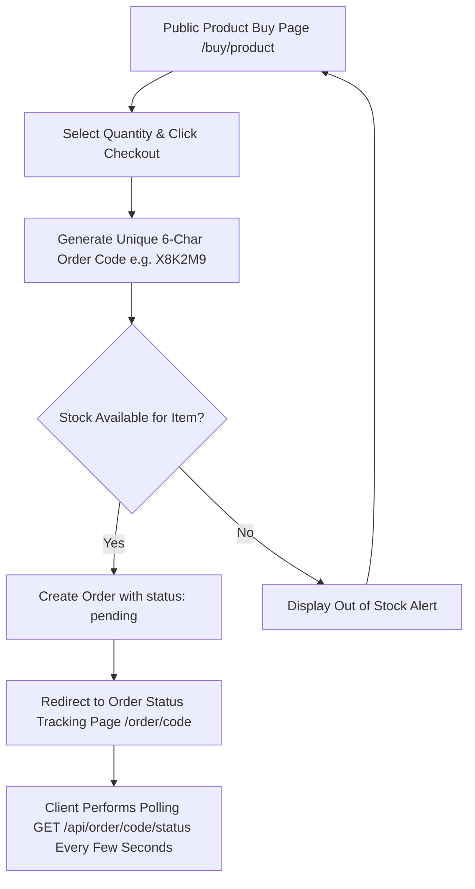
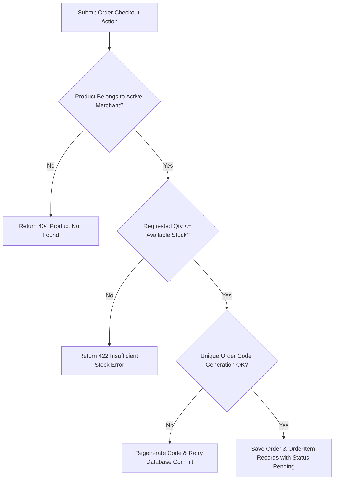
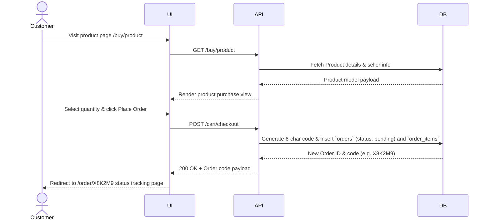
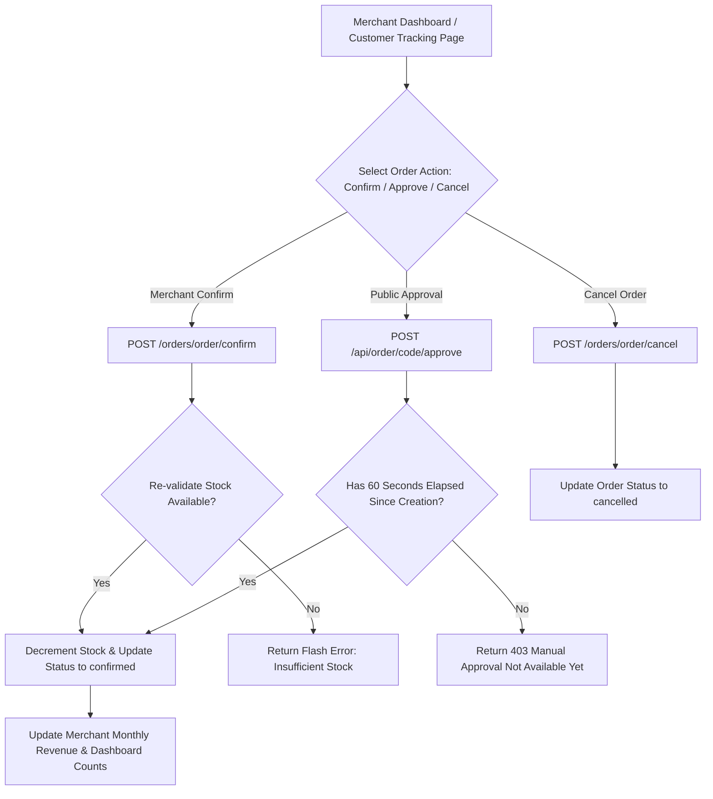
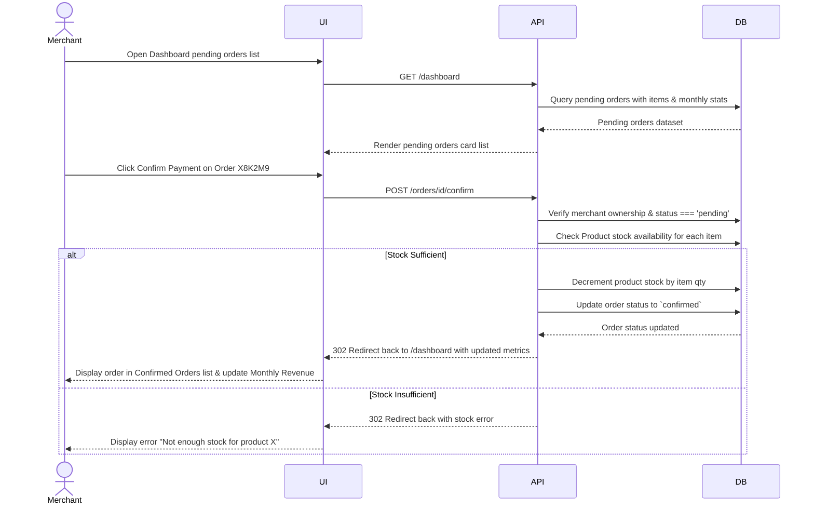
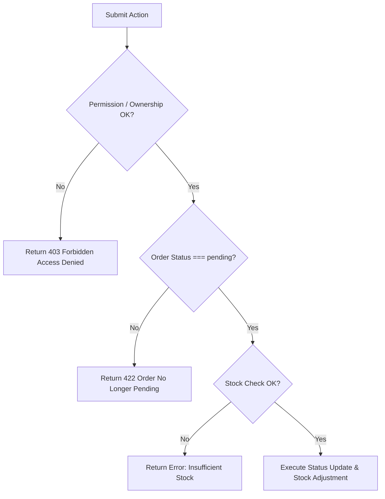
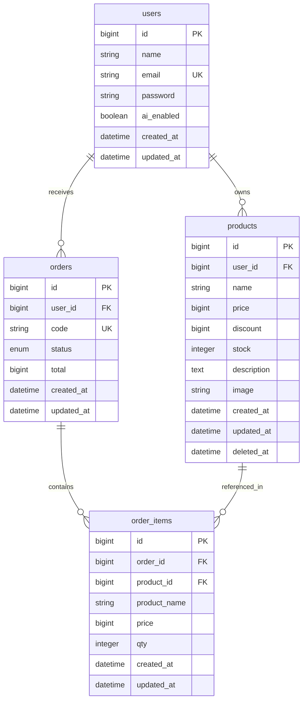

# Docs Specification - QPay Merchant Checkout & Payment System

The QPay Merchant Checkout & Payment System is a modern micro-merchant POS and payment confirmation platform built with Laravel 12, Inertia.js (Vue), and Tailwind CSS. It enables sellers to showcase product catalogs, process online customer checkouts, execute instant POS manual cash sales, and track payment confirmations in real-time via live status polling (`GET /api/order/{code}/status`). Every purchase order generates a unique 6-character alphanumeric order code (e.g. `X8K2M9`). Scope covers public product purchase pages (`/buy/{product}`), cart checkout, seller dashboard metrics (monthly revenue, pending orders, confirmed sales), direct manual sales, live status polling, 60-second approval timers, and AI-enabled promotional assistant toggles.

**Version:** 0.1.0  
**Owner:** Rizqy  
**Last Updated:** 2026-07-27

## QPay Order & Payment System - Create

### Objectives

- Create purchase orders with unique 6-character order tracking codes (e.g., `QP-X8K2M9`) and initial `pending` status within 2 seconds of checkout.
- Support instant direct manual sales (`POST /products/{product}/manual-sale`) from the seller dashboard that auto-confirm order status and decrement product stock immediately.

### Assumptions and Constraints

- Merchant user must be authenticated and active (`ai_enabled` toggle optional for promo assistant).
- Product must exist in merchant catalog with `stock > 0` for direct stock deduction.
- Customer order codes are randomly generated from un-ambiguous character set (`ABCDEFGHJKLMNPQRSTUVWXYZ23456789`).

### Actors and Permissions

| Actor/Role | Permissions |
| --- | --- |
| Merchant / Seller | Manage products, trigger manual cash sales, confirm/cancel pending orders, toggle AI tools, view monthly revenue metrics |
| Customer / Buyer | View public product buy pages (`/buy/{product}`), add items to cart, submit checkout, poll order payment status |

### User Flow (Main)

Purpose: Primary user journey from entry to completion, focused on the happy path and key decisions.

### Error and Validation Flow

Purpose: Validation, permission, and system error paths, including user feedback and recovery behavior.

### Sequence Diagram - Create

Purpose: UI to API interactions for the create flow, including lookup calls and record insertion.

### Acceptance Criteria

1. Customers can place an order from the public product page or cart view, generating a unique 6-character code.
2. Orders created via standard customer checkout start in `pending` status.
3. Merchant direct manual sales (`manualSale`) auto-confirm immediately, set status to `confirmed`, and decrement stock.

## QPay Order & Payment System - Update

### Objectives

- Support merchant manual order confirmation (`POST /orders/{order}/confirm`) or public approval after a 60-second safety cooldown window (`POST /api/order/{code}/approve`).
- Ensure product stock is re-verified and decremented atomically upon order confirmation, while updating merchant monthly revenue metrics.

### Assumptions and Constraints

- Public manual approval endpoint (`/api/order/{code}/approve`) requires at least 60 seconds to elapse (`diffInSeconds >= 60`) after creation to prevent immediate abuse.
- Orders in status `confirmed` or `cancelled` cannot be re-confirmed or modified.

### Actors and Permissions

| Actor/Role | Permissions |
| --- | --- |
| Merchant / Seller | Confirm pending orders, cancel orders, perform manual stock adjustments |
| Customer / Buyer | Poll order status, trigger customer-side cancellation or manual approval after 60s cooldown |

### User Flow (Main)

### Sequence Diagram - Update

Purpose: UI to API interactions for update flow, including permission checks and side effects.

### Acceptance Criteria

1. Merchant can confirm pending orders from the dashboard, which re-checks stock, decrements product inventory, and updates status to `confirmed`.
2. Public approval endpoint enforces a 60-second cooldown timer before allowing manual confirmation.
3. Cancelling a pending order transitions status to `cancelled` without modifying product stock.

## Shared Diagrams and References

### Error and Validation Flow

Purpose: Validation, permission, and system error paths, including user feedback and recovery behavior.

### Data Model (ERD)

Purpose: Tables, relations, and key constraints required by this feature.

### API Contract Reference

| No | File | Description |
| --- | --- | --- |
| 1 | [contract-api/feature-openapi.yaml](contract-api/feature-openapi.yaml) | OpenAPI spec for QPay store checkout, polling, order confirmation, and AI endpoints. |

### Mock Data Reference

| No | File | Description |
| --- | --- | --- |
| 1 | [mockoon/feature-mock.json](mockoon/feature-mock.json) | Mock endpoints and sample JSON payloads for QPay orders, products, and status polling. |

### State or Status Lifecycle (Optional)

Order statuses transition through: `pending` -> `confirmed` (or `cancelled`). Live status polling on `/api/order/{code}/status` enables real-time client UI updates.

### Edge Cases

- **Concurrent Checkout Stock Depletion**: Multi-buyer checkout where stock drops to zero before merchant confirmation triggers stock validation errors on `confirm`.
- **Approval Cooldown Restriction**: Calling `/api/order/{code}/approve` within 60 seconds of creation returns a 403 error.
- **Manual Cash Sale**: POS direct sale generates a 6-character code and immediately sets status to `confirmed` with stock decrement.

### Observability

- **Dashboard Real-Time Metrics**: Live computation of `monthly_revenue`, `monthly_orders`, and `confirmed_orders` list per merchant.
- **Logging & Error Capture**: Detailed exception logging in `DashboardController` and `ProductController` with UUID debug IDs for troubleshooting.
- **Status Polling Efficiency**: Lightweight JSON response (`{ status: 'pending'|'confirmed'|'cancelled' }`) for high-frequency client polling.

## Change Log

| Date | Author | Change |
| --- | --- | --- |
| 2026-07-27 | Rizqy | Updated specification after thorough codebase audit of QPay routes, Inertia controllers, live polling endpoints, manual sales, and database schema. |
